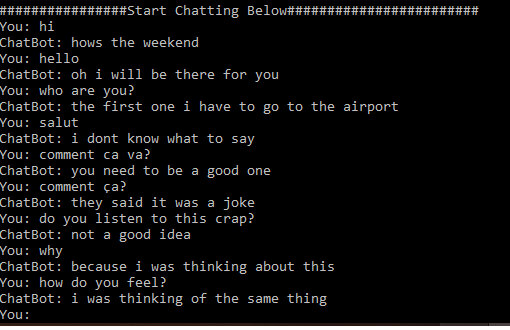

# Conversational-AI-Chatbot-using-Practical-Seq2Seq
A simple open domain generative based chatbot based on Recurrent Neural Networks

REQUIREMENTS

- python 3.5.4
- tensorflow 0.12.1

TRAINING YOUR OWN MODEL

Please refer to the link below to download the open source dataset.
https://www.cs.cornell.edu/~cristian/Cornell_Movie-Dialogs_Corpus.html

The dataset will contain many files out of which two files are to be used by us.
1. “movie_lines.txt”
2. “movie_conversations.txt”

Copy both of these files into the github repository containing main.py file.
These files are imported on the line 17 “#Importing the dataset”.
Please let me know if you have any questions. And do give a star to my GitHub repo if it is of help to you.

USING PRETRAINED WEIGHTS

1. For using the pretrained weights download them at https://drive.google.com/file/d/1oCIQTHi5GI7N4uH5gOVrdG0x1tt00wqs/view?usp=sharing.
2. Unzip the file and store them in a folder named "weights" inside the folder chatbot-pretrained weights.
3. Run the "the_best_chatbot.py" file.

Image Source: Semeh Ben Salem, PhD

For a better understanding please refer to my article https://medium.com/@harshpanwar9524/understanding-rnns-lstm-and-seq2seq-model-using-a-practical-implementation-of-chatbot-in-2b9ab76d1eda

